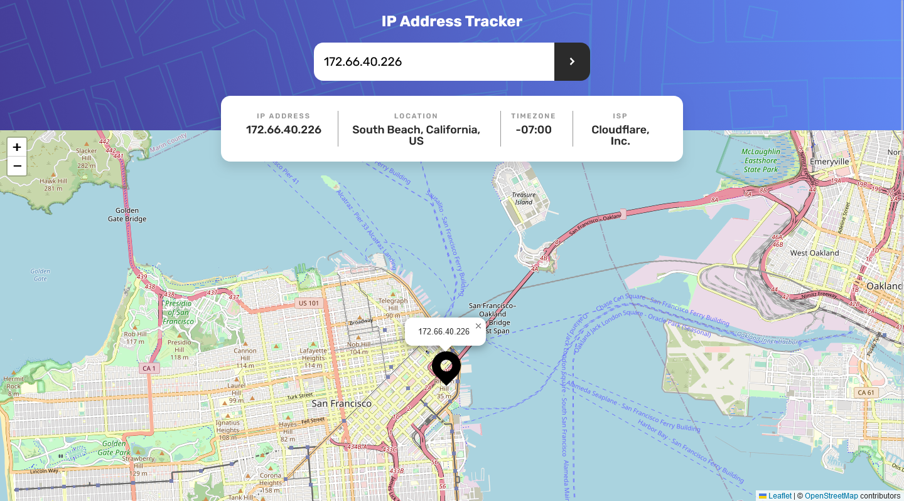

<div align="center">

# IP Address Tracker

</div>
<div align="center">

Challenge from [Frontend Mentor](https://www.frontendmentor.io/challenges)

<h2>

[🚀Live Site](https://ip-address-tracker-codepapa360.netlify.app/)
||
[💡Frontend Mentor]()

</h2>
</div>

<!-- Badges -->
<div align="center">


<!-- Liceensee -->


</div>

<!-- Brief -->
<p align="center">
Welcome to the IP Address Tracker! This web application lets you search for IP addresses and domains, providing you with essential information and geolocation details with a map view. With the power of Leaflet maps, Vanilla JS, Sass, and HTML, the app offers a smooth and responsive experience for users. Plus, I've added helpful popups to provide friendly feedback in case of any errors.
</p>

<!-- Screenshot -->
<a align="center" href="https://ip-address-tracker-codepapa360.netlify.app/">



</a>

## Key Features

Users should be able to:

- See their own IP address on the map on the initial page load
- Search for any IP addresses or domains and see the key information and location
- **Bonus:** Interactive Popup/Dialog - Get feedback popups when encountering errors or invalid inputs.
- View the optimal layout for each page depending on their device's screen size
- See hover states for all interactive elements on the page

## Built with

- JavaScript
- [Leaflet](https://leafletjs.com/) - a JavaScript library for interactive maps
- Sass
- HTML5
- Mobile-first workflow
- [Webpack](https://webpack.js.org/) - a module bundler for JavaScript.

## What I Learned

During the development of this project, I had the opportunity to enhance my error handling skills, especially when working with APIs. Dealing with potential errors and providing users with helpful feedback through interactive popups was a valuable learning experience.

Additionally, I focused on organizing my codebase more efficiently by separating specific functions and functionalities into different JavaScript files. This approach not only improved the project's maintainability but also made the code easier to understand and work with.

## Installation

- Clone this repo:

```sh
git clone https://github.com/CodePapa360/IP-Address-Tracker.git
```

- Install dependencies:

```sh
npm install
```

- Build command:

```sh
npm run build
```

- Live server:

```sh
npm start
```

## Author

<b>👤 Alamin</b>

- Twitter - [@CodePapa360](https://www.twitter.com/CodePapa360)
- LinkedIn - [@CodePapa360](https://www.linkedin.com/in/codepapa360)
- Frontend Mentor - [@CodePapa360](https://www.frontendmentor.io/profile/CodePapa360)
- Github: [@CodePapa360](https://github.com/codepapa360)

Feel free to contact me with any questions or feedback!

## Acknowledgments

This project was inspired by the "IP Address Tracker" challenge from Frontend Mentor. Special thanks to Frontend Mentor for providing the design and specifications for this project.

## License

This project is licensed under the [MIT](https://github.com/CodePapa360/IP-Address-Tracker/blob/main/LICENSE.md) License - see the LICENSE file for details.
